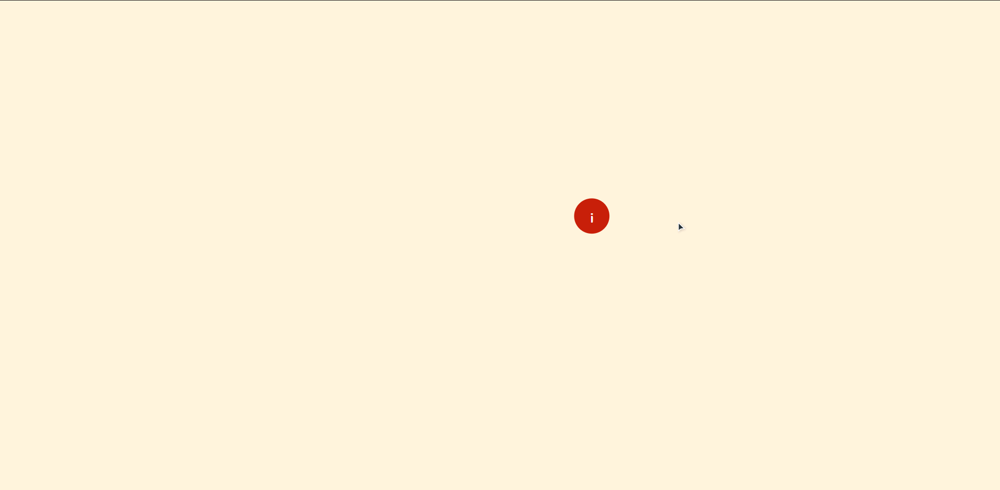

## Demo

---

# Local launch

1. Clone repo to your local machine: `git clone https://github.com/T-Damer/clip-path-card.git`
2. Go into folder: `cd clip-path-card`
3. Launch `index.html` locally. I personally use `Live Server` extension for VSCode
4. BONUS: to edit `.sass` file and see changes in no time, install `Live Sass compiler` extension to VSCode

---

